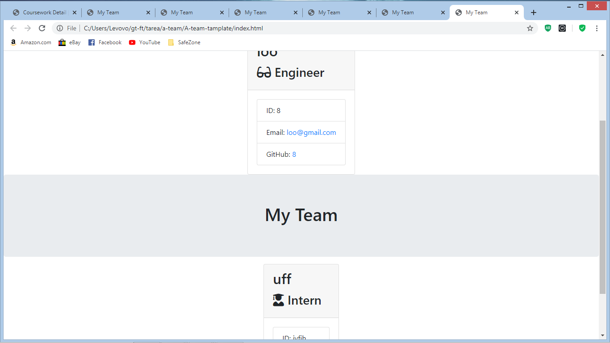

# A-team-tamplate
This project was given by the Georgia Tech Coding bootcamp
A team tamplate is a app rund by command line terminal where by running node on the root application. the terminal will prompt a set of questions and  using the promt answer renders a card with the emplyees info given by the user.

The lib folder contains all the employees class and the extended classes.
in the tamplates folder contains the html that the cammand line uses to make the employee card with the answers given by the user.

The test folder contains all the tdd test for the employee class and extended classes

There is one bug that is known is that the team tamplate only render one card at a time in the index html.

//code talk
some of node packages used in the projecet are the inquierer node package, filesystem node package. on the team javascript
files are the depedencies. 
 
 //line 16-38
 are the prompt questions 

 //line 40-49
 is the '.then' promise where asigned the prompt answeres to a new manager class with new name, id, email, office/school
 
 //52-59
 is a functions that uses file system  to  write/ render the new manager  inside the index.html file.
 

[this the link to the video](https://drive.google.com/file/d/1MPDk5yJzGW1qYmHzdwifFII0VJG_EFlK/view)
